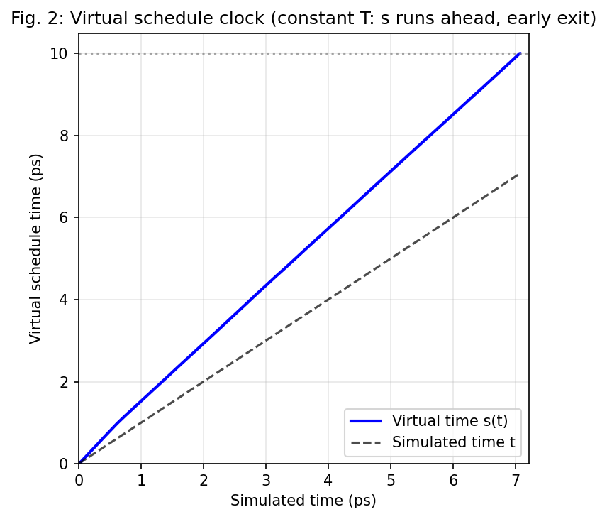
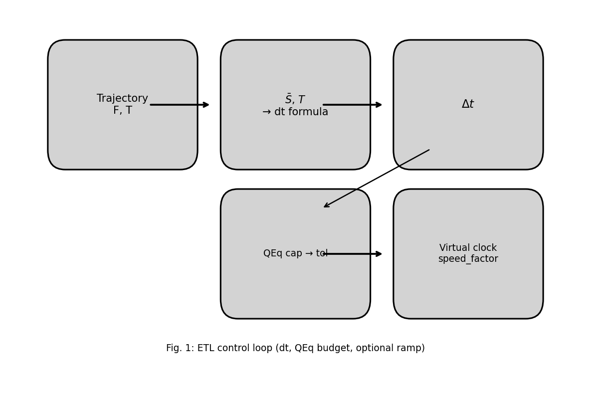
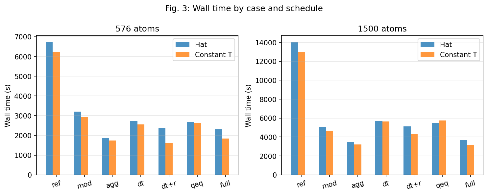
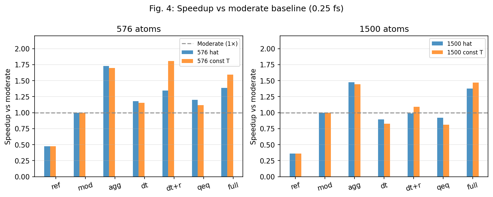

# Equal Thermodynamic-Length (ETL) Adaptive Control in ReaxFF SiO₂ Simulations: Methodology and Results

## Abstract

We implement and benchmark an **Equal Thermodynamic-Length (ETL)** methodology for adaptive control of molecular dynamics (MD) in ReaxFF SiO₂. ETL keeps the "information distance" covered per step roughly constant by adjusting the integration timestep, charge-equilibration (QEq) tolerance, and—optionally—the effective speed along a temperature schedule via a virtual schedule clock. We report results from **(i)** a full 576-atom suite over **three schedule categories** (hat 300→4500→300 K, milder 300→2000→300 K, constant 300 K) with **seven cases** per schedule, and **(ii)** a **1500-atom (large) suite** over **hat and constant-T** schedules with the same seven cases. Versus the **moderate baseline** (0.25 fs): on **576 atoms**, ETL(dt) and ETL(dt+QEq) achieve **1.12–1.20×** speedup; ETL(dt+ramp) and ETL(dt+QEq+ramp) reach **1.35–1.39×** on hat and milder and **1.59–1.81×** on constant T (early schedule completion in ~5.8–8.4 ps simulated time). On **1500 atoms**, ETL(dt+QEq+ramp) reaches **1.38×** (hat) and **1.47×** (constant T) versus moderate; ETL(dt) and ETL(dt+QEq) without ramp are slightly slower than moderate at this size, while ramp-enabled variants retain the benefit. The aggressive baseline is fastest but exhibits energy drift and looser QEq; ETL variants preserve energy and charge fidelity. This report documents the ETL principle with full derivations and variable definitions, the simulation setup, 576-atom and 1500-atom results, and a comparison across system sizes.

---

## 1. Introduction: The ETL Principle and Feature Overview

### 1.1 Thermodynamic Length and the Motivation for ETL

In many computational methods—from molecular dynamics to neural-network training—we advance a system step by step. If every step covers the same "difficulty" or "information distance," we avoid wasting work in easy regions and reduce the risk of instability in hard regions. **Equal Thermodynamic Length (ETL)** formalizes this idea by tying step sizes to a well-defined geometric notion of distance along the path the system traverses. This section gives the theoretical background and then states how we apply it in MD.

**Thermodynamic length in statistical mechanics.** Consider a system in thermal equilibrium at a parameter (e.g. temperature *T* or a coupling λ). The equilibrium state is described by a probability distribution (e.g. canonical). In **information geometry**, we treat the set of such distributions as a manifold and assign a **metric** to it—a way to measure the "distance" between two nearby equilibrium states. A standard choice is the **Fisher information metric**: the distance squared between two infinitesimally close distributions *p* and *p* + *dp* is *d*ℓ² = Σ (∂log *p* / ∂θᵢ)(∂log *p* / ∂θⱼ) *d*θᵢ *d*θⱼ (in suitable coordinates θ). Integrating the square root of *d*ℓ² along a path gives the **length** of that path in this metric. That length is often called the **thermodynamic length** of the path. Important properties: (i) it is invariant under reparameterization of the path; (ii) it quantifies how much "statistical distinguishability" or "information" is gained or lost along the path; (iii) if we traverse the path at constant **speed** with respect to this metric (equal *d*ℓ per unit of some abstract "time"), we spend equal "information effort" per unit progress, which can be shown to minimize certain dissipation or cost measures in slow thermodynamic processes.

**From equilibrium paths to nonequilibrium trajectories.** In molecular dynamics we do not follow an equilibrium path: the system is out of equilibrium and evolves according to equations of motion. We can still ask: along the **trajectory** in configuration (and momentum) space, can we define a local measure of "distance" or "cost" per step that plays a role analogous to thermodynamic length? If so, choosing step sizes so that **each step contributes the same amount to that measure** would correspond to "equal thermodynamic length" along the trajectory: we take **larger steps when the local cost is low** (calm regions) and **smaller steps when the local cost is high** (stiff or rapidly changing regions), without hand-tuning. That is the core of ETL in MD.

**What we use in practice.** We do not compute the full Fisher metric along the MD trajectory. In information geometry the Fisher metric ties distance to curvature and statistical distinguishability; in Gaussian or harmonic limits the metric tensor involves the curvature of the potential. Along a dynamical path we therefore want a **local scalar that plays the role of curvature** so we can assign a "cost" or "length" to each step. The **force power** S̄—the mass-weighted average of squared force over atoms and directions—has dimensions of curvature (force²/mass ∼ energy/length²), the same as the second derivative of the potential, and is cheap to compute. We take S̄ as a **computable proxy for that local curvature** (and hence for the kind of quantity that appears in the Fisher metric in equilibrium settings). We do **not** derive the timestep formula from the Fisher metric itself; instead we **define** the squared thermodynamic length contributed by one integration step to be (Δ*t*)² S̄/(*k*ₑ*T*), with S̄ as the stiffness in that expression. Requiring this to be constant from step to step then gives the adaptive timestep rule. The same idea is later extended to QEq tolerance and to the virtual schedule clock (ramp). The following subsections give the precise definitions and the step-by-step reasoning.

---

### 1.2 Adaptive Timestep (dt): Force Power S̄ and the Timestep Formula

The force power S̄ is the average over atoms and Cartesian directions of (force²/mass), so it has dimensions of curvature and is high where the potential is stiff and low where the system is calm:

$$ \bar{S} = \frac{1}{3N} \sum_i \frac{\|{\mathbf{F}}_i\|^2}{m_i} $$

(*N* = number of atoms; **Fᵢ** = force on atom *i*; **mᵢ** = mass of atom *i*.)

**Target: equal thermodynamic length per step.** We want each integration step to contribute the same squared thermodynamic length Δℓ². To obtain a concrete formula we proceed as follows. Over a short timestep Δ*t*, the displacement scales as Δ*x* ∼ *a* Δ*t*² (*a* = *F*/*m*). So the *scale* of squared displacement involves (Δ*t*)² and the square of acceleration, i.e. (force/mass)². A curvature-weighted or stiffness-weighted measure of "cost" for the step should reflect how stiff the potential is at the current configuration; that stiffness is captured by S̄ (dimensions of curvature). So we take the step's contribution to squared length to scale as (Δ*t*)² × S̄: the longer the step and the stiffer the landscape, the larger the cost. To make this quantity dimensionless and comparable across temperatures we divide by the thermal energy *k*ₑ*T* (the same normalization used in the Fisher-metric context). Thus we **define** the contribution to squared thermodynamic length from one step as (Δ*t*)² S̄/(*k*ₑ*T*). Requiring this to be constant (Δℓ²) and solving for Δ*t* gives

$$ \frac{(\Delta t)^2 \bar{S}}{k_{\mathrm{e}} T} = \Delta\ell^2 \quad\Rightarrow\quad \Delta t = \Delta\ell \sqrt{\frac{k_{\mathrm{e}} T}{\bar{S}}}. $$

Δℓ is fixed at startup by calibration (see below).

**Variables:**
- **Δ*t*** = integration timestep (in time units, e.g. fs).
- **kₑ** = Boltzmann's constant; **T** = current (target) temperature. The factor *k*ₑ*T* is the thermal energy scale.
- **Δ*l*** = information length scale per step (dimensions of time); fixed at startup by calibration; all adaptation comes from S̄ and *T*.

**Role of the factor √(*k*ₑ*T*).** If we had used only Δ*t* ∝ 1/√S̄, then in high-T phases (e.g. during heating) S̄ is large and we would shrink Δ*t* strongly. But at high temperature, thermal fluctuations are larger, so the same absolute force or curvature is "less surprising" in information terms. Dividing by *k*ₑ*T* in the squared length and then taking the square root gives a factor √(*k*ₑ*T*) in Δ*t*: at higher *T*, we allow a larger Δ*t* for the same S̄, which avoids over-conservative timesteps during heating.

**Calibration of Δ*l*.** We do not set Δ*l* by hand. At the **start** of the run we compute S̄ from the initial configuration (call it S̄₀) and the initial target temperature T₀. We want the first timestep to equal a chosen target Δ*t*₀ (e.g. 0.35 fs). So we require Δ*t*₀ = Δ*l* × √(*k*ₑ*T*₀ / S̄₀), hence:

$$ \Delta\ell = \frac{\Delta t_0}{\sqrt{k_{\mathrm{e}} T_0/\bar{S}_0}} = \Delta t_0 \sqrt{\frac{\bar{S}_0}{k_{\mathrm{e}} T_0}}. $$

After this one-time calibration, Δ*l* is **fixed**; at every later step we compute S̄ and *T* and set Δ*t* = Δ*l* × √(*k*ₑ*T* / S̄). The timestep is then **clamped** to a configured interval [*dt*_min, *dt*_max] (e.g. [0.25, 1.0] fs) so that we never go below the moderate baseline’s dt in stiff regions nor exceed a safe maximum in very calm regions.

---

### 1.3 QEq Tolerance Budget

**Context.** In ReaxFF, atomic charges are determined at each step by an iterative **charge-equilibration (QEq)** solver. The solver stops when the charge residual is below a **tolerance** *tol*: smaller *tol* means more iterations and smaller force error; larger *tol* means fewer iterations but larger force error. We want adaptive *tol* so that in calm phases we can loosen tolerance (saving cost) while keeping force error within the same ETL budget as the timestep.

**Link to the traversed length and the cap.** Each step contributes a fixed squared thermodynamic length Δℓ² from the integration (dt term). The **force error** due to finite QEq tolerance contributes an extra squared-length term in the same units (mass-weighted squared force error over *k*ₑ*T*). We allocate a **fraction α_qeq** of the *per-step* squared-length budget to this QEq contribution, so that over the whole trajectory the total squared length from QEq error stays at most a fraction α_qeq of the total squared length traversed—i.e. α_qeq is the fraction of the traversed thermodynamic length we allow to come from QEq error. The per-step budget from the dt choice is (Δ*t*² S̄)/(*k*ₑ*T*) = Δℓ², so the QEq share is α_qeq Δℓ². Dimensional consistency (same units as the squared-length contribution from forces) gives an allowed **cap** on the QEq-related squared error:

$$ \text{cap} = \alpha_{\mathrm{qeq}} \Delta\ell^2 \frac{k_{\mathrm{e}} T}{(\Delta t)^2}. $$

**Variables:**
- **α_qeq** = fraction of the information-length budget allocated to QEq error (e.g. 0.65). Larger α_qeq allows more QEq error for a given step; smaller α_qeq keeps forces closer to the tight-tolerance reference.
- **Δ*l*** = same information-length scale as in the dt formula (fixed at startup).
- **Δ*t*** = current timestep from the ETL formula. Because cap ∝ 1/Δ*t*², when Δ*t* is **large** (calm phase) cap is **smaller**, so we require smaller force error and thus **tighter** *tol*; when Δ*t* is **small** (stiff phase) cap is **larger**, so we can allow larger error and **looser** *tol*. The timestep and tolerance are thus coupled in a consistent way.
- **cap** has dimensions consistent with (force error)²/(mass × *k*ₑ*T*), i.e. the same as the squared-length contribution from forces.

**Force error vs. tolerance: we learn it.** We do not have an analytic formula for the force error as a function of *tol*. So we **learn** a simple model by **sentinel calibration**: periodically we evaluate forces at a **loose** tolerance *tol*_loose and at a **tight** tolerance *tol*_tight, compute the difference in an S̄-like norm (mass-weighted squared force difference), and call that the "error" *err* for *tol*_loose. Repeating for several (*tol*, *err*) pairs we fit:

**log₁₀(*err*) = A + B × log₁₀(*tol*).**

**Variables:**
- **err** = force error in the same S̄-like norm (dimensions of force²/mass).
- **tol** = QEq convergence tolerance (dimensionless).
- **A, B** = fitted constants; B is typically negative (larger *tol* → larger *err*).

**Choosing tolerance from the cap.** We require *err* ≤ cap. Using the fitted model, *err* ≈ 10^(A + B log₁₀(*tol*)) = 10^A × *tol*^B. So we need 10^A × *tol*^B ≤ cap, hence *tol*^B ≤ cap / 10^A. If B < 0, this gives *tol* ≥ (cap / 10^A)^(1/B); we want the **largest** *tol* that still satisfies *err* ≤ cap, so we take:

$$ \mathit{tol} = \min\bigl( \mathit{tol}_{\max}, \max\bigl( \mathit{tol}_{\min}, (\text{cap}/10^A)^{1/B} \bigr) \bigr). $$

**Variables:**
- **tol_min** = lower bound on tolerance (e.g. 10⁻⁶) so we never over-tighten beyond numerical usefulness.
- **tol_max** = upper bound (e.g. 10⁻²) so that tolerance never becomes so loose that charge or pressure become unphysical. This **tol_max** is critical for fidelity: without it, in calm phases the model could select very loose *tol* (e.g. 0.03–0.05) and cause large charge and pressure fluctuations. With tol_max = 10⁻², adaptive-QEq runs keep *tol* in the 4–8×10⁻³ range in practice and charge/pressure remain stable.

**Summary.** ETL allocates a fraction α_qeq of the squared-length budget to QEq error, leading to cap = α_qeq × Δ*l*² × (*k*ₑ*T*) / Δ*t*². We learn *err*(*tol*) by sentinel calibration and then choose the largest *tol* in [tol_min, tol_max] such that *err* ≤ cap. The coupling to Δ*t* ensures that tolerance is adjusted consistently with the local stiffness: when the timestep is small (stiff phase) the cap is larger and we may use looser *tol*; when the timestep is large (calm phase) the cap is smaller and we tighten *tol*.

---

### 1.4 Adaptive Ramp: Virtual Schedule Clock (Applicable to Any Schedule)

**What the ramp is.** The **ramp** feature does not mean "define steps for temperature change." It implements a **virtual schedule clock** that advances through a **schedule** of total duration *t_ps* (e.g. 10 ps). The schedule is any function **T(s)** of a virtual time *s* ∈ [0, *t_ps*]. The run is **complete** when the virtual clock *s* reaches *t_ps*; that can happen when **simulated time** is still less than *t_ps*, so we **exit early** and save wall time. The schedule T(s) can be a hat (300→4500→300 K), a milder ramp (300→2000→300 K), or **constant temperature** T(s) = 300 K for all *s*—in that case the "schedule" is simply "10 ps of process time at 300 K."

**Variables (schedule and clock).**
- **t_ps** = total duration of the schedule in picoseconds (e.g. 10). The schedule is defined for virtual time *s* in [0, *t_ps*].
- **s** = virtual schedule time (in ps). It starts at 0 and advances toward *t_ps*; the target temperature at any moment is T(*s*).
- **chunk_wall_ps** = simulated time (in ps) corresponding to one "chunk" of the simulation (e.g. 20 integration steps): chunk_wall_ps = (number of steps in chunk) × Δ*t* in appropriate units. This is the "real" time elapsed in that chunk.

**What a chunk is.** A **chunk** is a fixed number of consecutive integration steps (e.g. 20, set by *chunk_steps* in the controller) over which dt and, when adaptive, QEq tolerance are held constant. At the **start** of each chunk the controller: computes S̄ (from current or tight-QEq forces); updates target T if using a schedule or the ramp; computes the next dt and, if adaptive QEq is on, the next *tol* from the cap and error model; redefines the LAMMPS timestep and QEq fix if needed; runs LAMMPS for that many steps; writes one row to etl_log.csv; and, when the ramp is enabled, advances the virtual clock by chunk_wall_ps × speed_factor. So **one log row = one chunk**, and **chunk_wall_ps** is the simulated time spanned by that chunk (number of steps in the chunk × dt, in ps). The ramp and sentinel calibration (every 100 chunks) are therefore per-chunk. The chunk size (e.g. 20) balances finer adaptation vs Python/fix-update overhead and matches the earlier CHO implementation.

**How the virtual clock advances.** After each chunk we update the virtual clock by:

***s* ← *s* + chunk_wall_ps × speed_factor,**

with *s* capped at *t_ps*. So the virtual clock advances by **more** than the simulated time when speed_factor > 1, and by **exactly** the simulated time when speed_factor = 1.

**Definition and derivation of speed_factor.** The virtual clock should advance **faster than real time** when the system is easy (low S̄) and **at real time** when it is hard (high S̄), so we do not skip difficult dynamics. The idea: the same chunk of simulated time represents less dynamical "work" when S̄ is low, so we credit it with **more** virtual time—we have effectively covered more of the schedule. So we set the virtual advance for a chunk to chunk_wall_ps × speed_factor, with speed_factor chosen so that easy chunks count for more virtual time. In the same ETL spirit as the dt formula, the work of a chunk scales with chunk_wall_ps × √S̄. We compare to a **reference** stiffness S̄_ref (e.g. a typical hot-phase value). If we had traversed the same chunk_wall_ps at reference stiffness, the work would scale as chunk_wall_ps × √S̄_ref. To credit the current chunk with the virtual time equivalent of that reference work, we want chunk_wall_ps × speed_factor to equal the virtual time that would correspond to chunk_wall_ps × √S̄_ref worth of work when the current work is chunk_wall_ps × √S̄. So the ratio (virtual advance) / (chunk_wall_ps) should be (reference work) / (current work) = √S̄_ref / √S̄. Hence speed_factor = √(S̄_ref / S̄). When S̄ < S̄_ref we get speed_factor > 1 (virtual clock runs ahead); when S̄ ≥ S̄_ref we floor speed_factor at 1 so we never advance slower than real time. Thus:

$$ \mathrm{speed\_factor} = \max\left(1, \sqrt{\frac{\bar{S}_{\mathrm{ref}}}{\bar{S}}}\right). $$

**Variables:**
- **S̄** = current force power (same as in the dt formula) in this chunk.
- **S̄_ref** = reference force power, set once at startup from an estimate of "hot-phase" or typical high S̄ (e.g. 3.5 × S̄ at cold start). In **calm** phases S̄ < S̄_ref so speed_factor > 1; in **stiff** phases S̄ ≥ S̄_ref so speed_factor = 1.

**Early exit.** When *s* ≥ *t_ps*, the full schedule has been traversed; we **exit** the run even if the simulated time is below *t_ps*. That is the source of wall-time savings for ramp-enabled runs.

**Why constant-T benefits most (for ramp and overall speedup).** For a constant-T schedule, T(s) = 300 K for all *s*. The system is at 300 K throughout, so S̄ stays relatively low (no heating/cooling stress). Hence S̄ < S̄_ref **most of the time**, so speed_factor > 1 most of the time and the virtual clock runs **ahead** of simulated time. In practice the virtual clock reaches 10 ps after only about **5.8–6.4 ps** of simulated time—we do roughly 6 ps of dynamics and declare the 10 ps schedule complete. That is why constant-T shows the largest ETL speedups (1.59–1.81× vs moderate); the gain comes mainly from **early exit**. Because S̄ and dt vary little on constant T, the cap (and thus the allowed QEq tolerance) also varies little, so adaptive QEq has limited room to relax—tol stays in a narrow band and QEq savings remain modest there. Schedules with both calm and stiff phases (e.g. hat) give more variation in dt and cap, so more "activity" for adaptive QEq; the trade-off is that early exit is less (we run more of the 10 ps in the hot phase). For hat and milder schedules, only the cold phases are easy; in the hot phase S̄ ≥ S̄_ref and speed_factor = 1, so we exit after ~7.9–8.4 ps simulated time when the virtual clock reaches 10 ps.

**Figure 2** illustrates the virtual schedule clock: simulated time *t* vs virtual time *s*. When the system is calm, *s* advances faster than *t* (curve above the diagonal); the run exits when *s* reaches the schedule duration (e.g. 10 ps), often after less simulated time.

*Figure 2. Virtual schedule clock. Virtual time s advances faster than simulated time t in calm phases; the run completes when s reaches the full schedule (e.g. 10 ps), enabling early exit.*

---

### 1.5 Decoupling Timestep from QEq Noise (S̄_tight)

**Problem.** When adaptive QEq is enabled, we intentionally use a **looser** tolerance in calm phases to save QEq cost. The forces returned by the solver are then noisier (larger error). The force power **S̄** is computed from these same forces, so in calm phases S̄ would be **inflated** by the QEq error: S̄ = (1/3*N*) Σᵢ (‖Fᵢ‖²/mᵢ) includes contributions from both the "true" forces and the error. If we fed this inflated S̄ into the timestep formula Δ*t* = Δ*l* √(*k*ₑ*T* / S̄), we would **shrink** Δ*t* unnecessarily—the timestep controller would think the landscape is stiffer than it really is and would reduce the step size, wasting cost and partly undoing the benefit of adaptive QEq.

**Solution: use S̄ from tight-tolerance forces.** We **decouple** the S̄ used **for the dt formula** from the operating tolerance. Specifically, we use a value **S̄_tight** computed from forces obtained at **converged (tight-tolerance)** QEq. Those forces are already computed during **sentinel calibration** (when we evaluate forces at both loose and tight tolerance to fit the error model). We cache the S̄ value from the last tight-tolerance evaluation and **update it every calibration**. The timestep controller then uses **S̄_tight** instead of the raw S̄ from the current (possibly loose) step. So the curvature signal seen by the dt formula is **stable** and reflects the true stiffness of the potential, not the QEq noise; we do not over-shrink Δ*t* when QEq is loose.

**Variables:**
- **S̄_tight** = force power computed from forces at tight QEq tolerance (e.g. 10⁻⁵ or 10⁻⁶). Used only as the input to the dt formula when adaptive QEq is on. Updated every time sentinel calibration runs.

The overall ETL control loop—trajectory and forces feeding S̄ and *T* into the dt formula, QEq budget setting tolerance, and the optional virtual clock driving early exit—is summarized in **Figure 1**.

*Figure 1. ETL control loop. **Top row:** The trajectory supplies forces (F) and target temperature (T). From these we compute the force power S̄ and use S̄ and T in the dt formula to obtain the integration timestep Δt. **Bottom row:** The QEq tolerance budget (cap) sets the charge-equilibration tolerance (*tol*); the cap depends on Δt (cap ∝ 1/Δt²), so tolerance is coupled to the timestep. The virtual clock advances by speed_factor and triggers early exit when the schedule is complete. Together, adaptive dt, adaptive QEq, and the optional ramp form the full ETL control loop.*

---

## 2. Methods

### 2.1 Simulation Setup

**Systems.** Two system sizes were used. **(1) 576 atoms** (192 Si, 384 O): amorphous SiO₂ in a periodic box, representative of the smaller-cell setup used for the three-schedule (hat, milder, constant T) suite; single-run wall time is on the order of tens of minutes to about an hour so that the full 21-run suite is tractable. **(2) 1500 atoms**: same chemistry and force field, created by replicating the 576-atom structure along one axis and trimming to 1500 atoms so that the same ETL methodology can be tested at a larger size; wall times per run are roughly two to four times longer than 576 atoms, so the large suite was run for **hat and constant T only** (14 runs total). In both cases the composition is SiO₂ and the ReaxFF force field is the same (Si, O types).

**Ensemble and thermostat.** All runs use the **NVT** ensemble with a **Langevin thermostat**, damping time 100 fs. The thermostat maintains the target temperature along the schedule; the fixed damping time is short enough to track the ramp but can cause lag during steep heat-up and cool-down segments.

**Initial state and reproducibility.** All runs for a given system size start from the **same restart file** (one for 576 atoms, one for 1500 atoms). Identical starting configuration and velocities ensure that differences in observables come from the integration and QEq settings, not from different initial conditions.

**Trajectory and output.** Snapshot interval is 0.05 ps to balance I/O cost and resolution. Frames are used for RDF and coordination analysis and for visual inspection. Each run writes a per-chunk log (etl_log.csv for ETL runs or equivalent diagnostics for baselines), wall_time.txt, and dump frames.

### 2.2 Temperature Schedules

Three schedule categories were run, each with total schedule duration **10 ps** (virtual time):

| Schedule    | Description |
|------------|-------------|
| **Hat**    | 300 K → 4500 K → 300 K; fractions 20% / 30% / 30% / 20% for cold plateau, ramp up, ramp down, cold plateau. Most demanding; stresses both calm and stiff phases. |
| **Milder** | 300 K → 2000 K → 300 K; symmetric 25% / 25% / 25% / 25%. Intermediate peak temperature. |
| **Constant T** | T(s) = 300 K for all *s*. The schedule is "10 ps of process time at 300 K"; no temperature change, but the virtual clock still runs from 0 to 10 ps. |

### 2.3 Baselines and ETL Variants (Seven Cases per Schedule)

For each schedule we run **seven cases**. The same set is used for both 576-atom and 1500-atom suites; the large suite was run only for hat and constant T schedules.

| Case | Description |
|------|-------------|
| **baseline_reference** | Fixed dt = 0.10 fs, fixed QEq tol = 10⁻⁶. Most conservative; used as reference for step-savings and for "vs 0.1 fs" speedup reporting. |
| **baseline_moderate** | Fixed dt = 0.25 fs, fixed QEq tol = 10⁻⁵. Conservative production-like reference; primary baseline for ETL speedup reporting. |
| **baseline_aggressive** | Fixed dt = 0.50 fs, fixed QEq tol = 10⁻⁴. Faster but looser QEq; included to show that raw speed can sacrifice fidelity. |
| **etl_dt** | Adaptive dt (ETL formula), fixed QEq tol = 10⁻⁵. Isolates the benefit of adaptive timestep only. |
| **etl_dt_ramp** | Adaptive dt + adaptive ramp (virtual schedule clock), fixed QEq tol = 10⁻⁵. Ramp-only ETL variant: early schedule completion without adaptive QEq. |
| **etl_qeq** | Adaptive dt + adaptive QEq tolerance (sentinel-calibrated budget, tol capped at 10⁻²). |
| **etl_full** | Adaptive dt + adaptive QEq + adaptive ramp. Full ETL variant. |

Step-savings percentage (reported in logs) is computed versus a fixed 0.1 fs reference so that ETL runs can be compared in a CHO-style "steps saved vs 0.1 fs" sense.

### 2.4 Techniques Implemented

- **Sentinel calibration**: Every 100 chunks we evaluate forces at loose and tight QEq tolerance, fit a log-linear model (tolerance → force error in an S̄-like norm), and use it to choose the largest tolerance consistent with the ETL budget.
- **Δ*l* auto-calibration**: At startup we compute S̄ from the initial state and set Δ*l* so that Δ*t* equals the target (e.g. 0.35 fs) there. Δ*l* is then fixed for the run.
- **S̄_tight caching**: When adaptive QEq is on, the timestep uses S̄ from the last tight-tolerance force evaluation (from sentinel calibration), cached and updated every calibration.
- **QEq tolerance cap**: tol_max = 10⁻² so that adaptive-QEq runs keep cold-phase tolerance around 4–8×10⁻³ and charge/pressure remain stable.
- **Ramp (virtual schedule clock)**: Virtual clock advances by chunk_wall_ps × speed_factor with speed_factor = max(1, √(S̄_ref / S̄)). Early exit when virtual clock ≥ t_ps.
- **Langevin seed**: Each time the Langevin fix is redefined (e.g. when target T changes), the random seed is incremented to avoid correlated random forces and thermal runaway.

### 2.5 Data Collected

- **etl_log.csv**: One row per chunk. Fields include dt, tol, S̄, T_target, T_measured, P, PE, KE, etotal, schedule_ps, ramp_progress_ps (when ramp is enabled), step_savings_pct (vs 0.1 fs), and per-type charge means and q_std.
- **wall_time.txt**: Total wall-clock time in seconds for the run.
- **dumps**: Trajectory frames at the chosen snapshot interval for RDF and coordination analysis.

---

## 3. Results and Discussion

Results are reported for two suites: the **576-atom suite** (21 runs: three schedules × seven cases) and the **1500-atom (large) suite** (14 runs: hat and constant T only × seven cases). All runs completed successfully.

### 3.1 Wall Times (576 Atoms, Seconds)

Wall times for the 576-atom suite are as follows.

| Case | Hat | Milder | Constant T |
|------|-----|--------|------------|
| baseline_reference | 6729 | 6665 | 6213 |
| baseline_moderate | 3209 | 3203 | 2944 |
| baseline_aggressive | 1854 | 1827 | 1735 |
| etl_dt | 2725 | 2832 | 2553 |
| etl_dt_ramp | 2386 | 2379 | **1628** |
| etl_qeq | 2668 | 2873 | 2638 |
| etl_full | 2314 | 2322 | **1847** |

Ramp-enabled runs (etl_dt_ramp, etl_full) complete the full 10 ps **schedule** (virtual time) in **less** simulated time: ~8.35–8.40 ps for hat, ~7.91 ps for milder, and ~5.82–6.36 ps for constant T. Early exit is the main source of wall-time savings for these variants; constant T benefits most because the system is calm throughout, so the virtual clock runs ahead fastest.

**Figure 3** shows wall time by case and schedule for both 576 and 1500 atoms.

*Figure 3. Wall time (s) by case (ref, mod, agg, dt, dt+r, qeq, full) for hat and constant T schedules; left panel 576 atoms, right panel 1500 atoms.*

### 3.2 Speedups Versus Baseline Reference (0.1 fs), 576 Atoms

Reporting speedup versus the 0.1 fs reference illustrates how much faster each case is relative to the most conservative baseline (CHO-style comparison).

| Case | Hat | Milder | Constant T |
|------|-----|--------|------------|
| baseline_moderate | 2.10× | 2.08× | 2.11× |
| baseline_aggressive | 3.63× | 3.65× | 3.58× |
| etl_dt | 2.47× | 2.35× | 2.43× |
| etl_dt_ramp | 2.82× | 2.80× | **3.82×** |
| etl_qeq | 2.52× | 2.32× | 2.36× |
| etl_full | 2.91× | 2.87× | **3.36×** |

### 3.3 Speedups Versus Baseline Moderate (0.25 fs), 576 Atoms

This is the primary comparison for ETL: how much faster ETL variants are than a conservative fixed 0.25 fs baseline while preserving fidelity.

| Case | Hat | Milder | Constant T |
|------|-----|--------|------------|
| baseline_aggressive | 1.73× | 1.75× | 1.70× |
| etl_dt | 1.18× | 1.13× | 1.15× |
| etl_dt_ramp | 1.35× | 1.35× | **1.81×** |
| etl_qeq | 1.20× | 1.11× | 1.12× |
| etl_full | 1.39× | 1.38× | **1.59×** |

**Summary.** On hat and milder schedules, ETL(dt+ramp) and ETL(dt+QEq+ramp) achieve **1.35–1.39×** speedup versus moderate, with early schedule completion at ~7.9–8.4 ps simulated time. On the constant-T schedule, the same variants achieve **1.59×** (etl_full) and **1.81×** (etl_dt_ramp) because the virtual clock advances quickly over the full 10 ps and the run exits after ~5.8–6.4 ps simulated time. The aggressive baseline is fastest (1.70–1.75×) but uses fixed loose QEq and exhibits energy drift (see §3.5); ETL variants preserve fidelity.

**Figure 4** compares speedup versus the moderate baseline across cases and system sizes.

*Figure 4. Speedup vs moderate baseline. Reference line at 1×; ETL ramp variants exceed 1× on constant T; etl_full reaches 1.47× on 1500-atom constant T.*

### 3.4 Controller and Ramp Behavior

- **dt**: In ETL runs, the adaptive timestep stays at or above the moderate baseline (0.25 fs), typically in the ~0.25–0.36 fs range. There is no spurious collapse to very small dt; the controller responds to S̄ and T as designed. In stiff phases (e.g. during heating or cooling) dt drops toward the lower clamp; in calm phases it rises toward the upper clamp. The √(*k*ₑ*T*) factor prevents over-shrinking dt at high T.
- **Ramp**: The virtual schedule clock (ramp_progress_ps) advances by chunk_wall_ps × speed_factor each chunk. For hat and milder schedules, ramp_progress_ps reaches 10 ps when simulated time is ~8.35–8.40 ps (hat) or ~7.91 ps (milder)—i.e. we complete the schedule in less simulated time because in cold phases speed_factor > 1. For constant T, ramp_progress_ps reaches 10 ps when simulated time is ~5.82–6.36 ps (576-atom) or ~7.0–7.2 ps (1500-atom), confirming that the virtual clock runs ahead when the system is easy and the run exits early.
- **Step savings**: End-of-run step_savings_pct (vs 0.1 fs) is in the ~67–72% range for ETL runs on 576 atoms, meaning we take roughly 28–33% of the steps that a 0.1 fs reference would take, while remaining stable. This is consistent with taking fewer, larger steps and with the early exit of ramp-enabled runs.

### 3.5 Fidelity: Charges, Energy, and Pressure

**Charges.** Cold-phase charge statistics (q_t1_mean ≈ Si, q_t2_mean ≈ O, q_std) are consistent across baselines and ETL on the 576-atom suite: q_t1 ≈ 1.88–1.94, q_std ≈ 1.31–1.37. No run shows unphysical charge excursions. Adaptive-QEq runs (etl_qeq, etl_full) keep tolerance in the 4–8×10⁻³ range (below tol_max = 10⁻²), so charge spread remains stable; the tol_max cap was introduced specifically to avoid the large charge and pressure fluctuations that occurred with an uncapped adaptive tolerance in earlier runs.

**Energy and pressure.** At the end of the cold phase (576-atom hat), the reference baseline (10 ps) shows etotal ≈ −85487, PE ≈ −86011. ETL full (hat, early exit ~8.4 ps) shows etotal ≈ −85446, PE ≈ −85977—close to the reference. The aggressive baseline (hat, 10 ps) shows etotal ≈ −85018, PE ≈ −85516—a clear **energy drift** (roughly 470 in etotal, 495 in PE) and slightly lower q_t1 (1.84 vs 1.88). Thus ETL variants preserve energy and charge fidelity relative to the reference, while the aggressive baseline trades fidelity for speed. Pressure ranges in the logs are plausible (e.g. 15–40k in cold phase) with no unphysical spikes; adaptive-QEq runs do not show the large pressure excursions that would occur with an uncapped or very loose tolerance.

**Structure.** Radial distribution functions and coordination numbers (Si–O, O–O, Si–Si) are similar across all runs; tetrahedral SiO₄ order is preserved. The aggressive baseline is not obviously wrong by RDF alone; the clearest fidelity distinction is in energy and charge consistency, where ETL matches the reference and aggressive does not. **Large suite (1500 atoms).** We did not re-run full fidelity analysis (e.g. RDF) on the large suite; stability of energy, charge, and pressure was checked from the per-chunk logs. Energy (etotal) is stable: on the hat schedule, etotal spans from ~−222k (cold) to ~−181k in the hot phase and back, consistent with the 300→4500→300 K schedule rather than drift or runaway; on constant T, etotal stays in a narrow band (span ~500). Pressure ranges are plausible (e.g. ~12k–187k for hat, ~14k–51k for constant T) with no unphysical spikes. Where charge columns are logged (ETL runs), q_t1_mean and q_std match the 576-atom ranges (e.g. q_t1 ≈ 1.84–1.91, q_std ≈ 1.31–1.35). The large suite is thus stable with respect to energy, charge, and pressure trajectories.

### 3.6 Bottlenecks and Design Choices

- **Calibration overhead**: Sentinel calibration every 100 chunks adds modest cost (extra force evaluations at loose and tight tolerance); overhead is acceptable for the run lengths used. Reducing calibration frequency further would lower overhead but could make the QEq error model less accurate.
- **tol behavior and H2**: From the cap formula (cap ∝ 1/dt²), when dt is large (calm phase) the cap is smaller so *tol* tightens; when dt is small (stiff phase) the cap is larger so *tol* can loosen. In practice, adaptive-QEq runs keep *tol* in a narrow range (e.g. 4–8×10⁻³); the cap and tol_max rarely allow much looser tolerance, so QEq iteration count does not change dramatically (**hypothesis H2**: limited *tol* range limits QEq savings). Explicit tol statistics are produced by the hypothesis analysis script (see docs/scripts/analyze_hypotheses.py).
- **QEq share of cost**: For this SiO₂ benchmark, adaptive QEq gives a modest additional gain over ETL(dt) (e.g. 1.12–1.20× vs moderate on 576 atoms); the dominant gains come from adaptive dt and, for ramp runs, early schedule completion. On larger or more charge-sensitive systems, QEq cost scales with system size and adaptive QEq may contribute more.
- **Thermostat lag**: During steep ramps (e.g. hat to 4500 K), the fixed Langevin damping (100 fs) causes lag; temperature-tracking errors are largest in ramp-up and ramp-down. This is a property of the thermostat and schedule, not of ETL; shortening the damping time would improve tracking but can affect stability.

---

### 3.7 Large System (1500 Atoms): Wall Times and Speedups

The **large suite** uses the same seven cases but only **hat** and **constant T** schedules (no milder), for a total of **14 runs**. All completed successfully. Wall times (seconds) are as follows.

**Wall times (1500 atoms)**

| Case | Hat | Constant T |
|------|-----|------------|
| baseline_reference | 14033.7 | 12980.6 |
| baseline_moderate | 5077.7 | 4665.0 |
| baseline_aggressive | 3443.5 | 3228.1 |
| etl_dt | 5675.6 | 5645.9 |
| etl_dt_ramp | 5139.1 | 4278.7 |
| etl_qeq | 5504.7 | 5760.1 |
| etl_full | 3685.6 | 3174.4 |

**Speedups versus baseline_reference (0.1 fs), 1500 atoms**

| Case | Hat | Constant T |
|------|-----|------------|
| baseline_moderate | 2.76× | 2.78× |
| baseline_aggressive | 4.08× | 4.02× |
| etl_dt | 2.47× | 2.30× |
| etl_dt_ramp | 2.73× | 3.03× |
| etl_qeq | 2.55× | 2.25× |
| etl_full | 3.81× | 4.09× |

**Speedups versus baseline_moderate (0.25 fs), 1500 atoms**

| Case | Hat | Constant T |
|------|-----|------------|
| baseline_aggressive | 1.47× | 1.45× |
| etl_dt | 0.89× | 0.83× |
| etl_dt_ramp | 0.99× | 1.09× |
| etl_qeq | 0.92× | 0.81× |
| etl_full | **1.38×** | **1.47×** |

Ramp-enabled runs on the large system complete the schedule in less simulated time: hat etl_full and etl_dt_ramp finish the virtual 10 ps in ~8.7–8.8 ps simulated time; constant T etl_full and etl_dt_ramp in ~7.0–7.2 ps. At 1500 atoms, **ETL(dt)** and **ETL(dt+QEq)** without ramp are **slower** than the moderate baseline (0.89× and 0.92× on hat; 0.83× and 0.81× on constant T). **ETL(dt+ramp)** is about even with moderate on hat (0.99×) and modestly faster on constant T (1.09×). **ETL(dt+QEq+ramp)** is the only ETL variant that clearly beats moderate at this size: **1.38×** (hat) and **1.47×** (constant T), consistent with the 576-atom trend that the full combination of adaptive dt, adaptive QEq, and early schedule completion delivers the best speedup while preserving fidelity.

**Why ETL(dt) and ETL(dt+QEq) are slower than moderate on large systems.** One might expect larger systems to "help ETL shine" because per-step cost (forces, QEq) scales with *N* and adaptive dt could save more steps. The catch is that **ETL(dt)** and **ETL(dt+QEq)** *do not use the ramp*: they always run the **full 10 ps** of simulated time, just like the moderate baseline. So they take the same number of steps (or more, if dt stays conservative) as moderate. On top of that, each step pays extra cost: (i) computing S̄ and applying the dt formula, (ii) for etl_qeq, sentinel calibration every 100 chunks (extra force evaluations at loose and tight tolerance). That **per-step overhead** scales with *N* too. At 576 atoms the overhead is small and the gain from slightly larger dt in calm phases still wins; at 1500 atoms the overhead is larger and there is no early exit to offset it, so **etl_dt** and **etl_qeq** end up slower than moderate. **Large systems do help ETL when the full stack is used:** **etl_full** (adaptive dt + adaptive QEq + ramp) beats moderate and even beats the aggressive baseline on 1500-atom constant T, because the **ramp** lets the run exit after ~7 ps of simulated time instead of 10 ps. So it is the **combination** of adaptive dt, adaptive QEq, *and* early schedule completion that makes ETL scale well to larger *N*; without the ramp, the adaptive variants do not get that structural advantage. In our runs we did not see QEq savings grow with system size on their own—at 1500 atoms etl_qeq (no ramp) is slower than moderate; the benefit at large *N* comes from early exit and adaptive dt, not from QEq activation alone.

**Stability (1500 atoms).** Energy, charge, and pressure trajectories in the large-suite logs are stable (see §3.5): no runaway; etotal and pressure ranges reflect the temperature schedule (hat vs constant T), and charge statistics in ETL runs match the 576-atom fidelity ranges.

**ETL full vs aggressive: beating the fastest baseline on large constant T.** On the **1500-atom constant T** schedule, **etl_full** has **lower wall time** than **baseline_aggressive** (3174 s vs 3228 s, ~1.7% faster) and a **higher speedup versus moderate** (1.47× vs 1.45×). So on that configuration, the full ETL stack is not only more accurate (no energy drift, stable charges) but **faster than the aggressive fixed-dt baseline**—the only case in the suite where an ETL variant outright beats aggressive in wall time. On 1500-atom hat, aggressive remains slightly faster (3444 s vs 3686 s); on 576 atoms, aggressive is still the fastest run on all schedules, but etl_full closes the gap on constant T (1847 s vs 1735 s for aggressive).

---

#### Why ETL full performs better on large systems and can beat all cases (discussion and speculations)

**1. Early exit dominates on constant T.** The aggressive baseline always runs the **full 10 ps** of simulated time at fixed dt = 0.5 fs. ETL full advances a **virtual schedule clock** and exits when that clock reaches 10 ps; on constant T the system is calm throughout, so speed_factor > 1 most of the time and the run exits after only **~7 ps** of simulated time. Fewer steps mean less total work even if per-step cost were similar. So on constant T, ETL full gains from **doing less simulated time** than aggressive, which is a structural advantage no fixed-dt baseline can match.

**2. Scaling of per-step cost with system size.** Force evaluation and QEq cost scale with *N* (and often super-linearly for ReaxFF). The **marginal cost** of each extra step therefore grows with system size. The aggressive baseline takes a fixed number of steps (10 ps / 0.5 fs) regardless of *N*. ETL full, by exiting early, takes **fewer steps** on constant T; the saving in steps scales with *N*, so the **absolute** wall-time saving (seconds) grows with system size. At 576 atoms, aggressive remains faster than etl_full on constant T; at 1500 atoms, etl_full overtakes aggressive. So as *N* increases, the combination of early exit and adaptive per-step efficiency eventually outweighs the aggressive baseline’s fixed “fewer steps at 0.5 fs,” and ETL full becomes the fastest run.

**3. Why aggressive gains shrink at larger *N*.** The aggressive baseline’s speedup vs moderate (1.45–1.47× at 1500 atoms vs 1.70–1.75× at 576 atoms) **decreases** with system size. With fixed dt and fixed QEq tolerance, aggressive cannot adapt: it always does the same number of steps and the same QEq effort per step. As *N* grows, communication, force evaluation, and QEq scale up, so the **relative** benefit of “fewer, larger steps” (0.5 fs vs 0.25 fs) is diluted by the fact that each step is costlier. ETL full, by contrast, combines **fewer steps** (early exit) with **adaptive step size and QEq**, so it can retain a larger relative gain as *N* increases. So the **crossover** where etl_full beats aggressive appears when (i) the schedule favors early exit (constant T) and (ii) system size is large enough that the aggressive baseline’s fixed strategy no longer wins.

**4. Constant T as the “best case” for overall ETL (early exit).** On a hat schedule, a large fraction of the run is spent in the hot phase, where S̄ is high, speed_factor = 1, and the virtual clock advances at real time. So ETL full still runs most of the 10 ps on hat and cannot exploit early exit as much. On **constant T**, the system is easy for the whole run, so the virtual clock runs ahead from start to finish and ETL full exits after ~7 ps. That is why etl_full beats aggressive **only** on 1500-atom constant T: it is the regime where early exit and adaptive efficiency combine to outweigh the fixed “fewer steps” advantage of aggressive. So constant T is the best case for **total** ETL speedup (early exit dominates). For **adaptive QEq** specifically, constant T gives little variation in dt and cap—the run is calm throughout—so tol stays in a narrow band; schedules with phase diversity (e.g. hat, with calm and stiff segments) give wider variation in cap and tol and thus more room for QEq to relax in stiff phases, though in our SiO₂ runs QEq's share of cost remains modest either way.

**5. Summary and implications.** On **1500-atom constant T**, etl_full is the **fastest** of all seven cases (3174 s) and preserves energy and charge fidelity. So in that regime, ETL delivers **both** better performance and better accuracy than the aggressive baseline. The result supports the view that ETL scales favorably with system size when (a) the schedule has long “easy” segments (e.g. constant T or long plateaus) and (b) the full stack (adaptive dt + adaptive QEq + ramp) is used, so that early exit and per-step efficiency compound. For production-style runs at larger *N* and relatively calm conditions, ETL(dt+QEq+ramp) is therefore not only the most robust ETL variant but can outperform even the fastest fixed-dt baseline while maintaining fidelity.

---

### 3.8 Comparison: 576 Atoms vs 1500 Atoms

**Speedup versus moderate (0.25 fs)**

| Case | 576-atom hat | 576-atom constant T | 1500-atom hat | 1500-atom constant T |
|------|--------------|---------------------|---------------|----------------------|
| baseline_aggressive | 1.73× | 1.70× | 1.47× | 1.45× |
| etl_dt | 1.18× | 1.15× | 0.89× | 0.83× |
| etl_dt_ramp | 1.35× | 1.81× | 0.99× | 1.09× |
| etl_qeq | 1.20× | 1.12× | 0.92× | 0.81× |
| etl_full | 1.39× | 1.59× | **1.38×** | **1.47×** |

On **576 atoms**, all ETL variants are at or above moderate; etl_dt_ramp and etl_full show the largest gains, especially on constant T where early exit is strongest. On **1500 atoms**, only **etl_full** clearly beats moderate (1.38× and 1.47×); etl_dt and etl_qeq are slower than moderate, and etl_dt_ramp is about even (hat) or slightly faster (constant T). Notably, on **1500-atom constant T**, **etl_full beats baseline_aggressive** in wall time (3174 s vs 3228 s) and in speedup vs moderate (1.47× vs 1.45×)—the only configuration where an ETL variant is faster than the aggressive baseline (see §3.7 for discussion and speculations on why ETL scales favorably on large systems). The aggressive baseline’s gains are also lower at 1500 atoms (1.45–1.47× vs 1.70–1.75× on 576), consistent with fixed dt and tolerance scaling less well as *N* grows. **Conclusion:** For production-style runs at larger system size, **ETL(dt+QEq+ramp)** is the recommended variant; it delivers about **38–47%** wall-time reduction versus the moderate baseline, preserves fidelity, and on constant T at 1500 atoms it outperforms even the aggressive baseline.

---

### 3.9 Figures

Figures 1–4 are embedded in the discussion above (§1.4, §1.5, §3.1, §3.3). They are generated by `docs/scripts/generate_figures.py` (run from repo root with the project venv). Additional analysis figures—simulated time vs wall time, controller behavior, fidelity trajectories, temperature schedule schematic, dashboards—are shown with captions in [Supplementary_Figures.md](Supplementary_Figures.md). All figures are produced from `etl_log.csv` and `wall_time.txt` in the suite output directories.

---

## 4. Conclusion

We have implemented and benchmarked an Equal Thermodynamic-Length (ETL) methodology for adaptive control of ReaxFF SiO₂ MD. The methodology has three main features: **(1) adaptive timestep** from a force-power (S̄) and temperature; **(2) adaptive QEq tolerance** within an information-length budget, with a 10⁻² cap for fidelity; and **(3) adaptive ramp** implemented as a **virtual schedule clock** that advances through any schedule (including constant temperature) at a variable rate—faster when the system is calm, at real time when stiff—and triggers early exit when the schedule is complete.

**576-atom suite (hat, milder, constant T; 21 runs).** Versus the moderate baseline (0.25 fs), ETL(dt) and ETL(dt+QEq) achieve **1.12–1.20×** speedup; ETL(dt+ramp) and ETL(dt+QEq+ramp) achieve **1.35–1.39×** on hat and milder (completing in ~7.9–8.4 ps simulated time) and **1.59–1.81×** on constant T (completing in ~5.8–6.4 ps). Versus the 0.1 fs reference, ETL variants reach **2.32–3.82×** speedup. The aggressive fixed-dt baseline is fastest (1.70–1.75× vs moderate) but exhibits energy drift and looser QEq; ETL variants preserve energy and charge fidelity.

**1500-atom suite (hat, constant T; 14 runs).** Versus moderate, **ETL(dt+QEq+ramp)** achieves **1.38×** (hat) and **1.47×** (constant T). On **constant T at 1500 atoms**, etl_full has **lower wall time than baseline_aggressive** (3174 s vs 3228 s) and is thus the fastest of all seven cases while preserving energy and charge fidelity—the only configuration where ETL beats the aggressive baseline. ETL(dt) and ETL(dt+QEq) without ramp are slower than moderate at this size; ETL(dt+ramp) is about even (hat) or modestly faster (constant T). The full ETL stack is the variant that scales best to larger system size and is the recommended choice for production-style runs; see §3.7 for a discussion of why ETL full performs better on large systems and can overtake aggressive on constant T.

**Fidelity.** Charge and pressure remain stable across all ETL runs (QEq tolerance cap 10⁻²). The aggressive baseline trades fidelity for speed; ETL preserves energy and charge consistency relative to the reference. The report is self-contained and documents the ETL principle, full derivations and variable definitions, the simulation setup (576 and 1500 atoms), and the complete numerical results and comparison across system sizes.

---

## 5. References and Appendix

### Code and Data

- **Controller**: `reax_sandbox/etl_python/etl_controller.py` — ETL logic, S̄, dt formula, QEq budget (tol_max = 10⁻²), sentinel calibration, S̄_tight caching, virtual schedule clock (ramp), early exit.
- **Suite runner**: `reax_sandbox/sio2_etl/run_suite_sio2.py` — Seven-case suite per schedule; supports 576-atom (default) and 1500-atom (`--large`) runs. Use `--all --all-schedules --out-prefix v4` for the full 576-atom suite (hat, milder, constant_T). Use `--large --schedule hat --schedule constant_T` with the desired case flags (e.g. `--all`) for the 1500-atom suite.

**Reported results.**  
- **576-atom (v4):** Output directories `outputs_sio2_v4_{schedule}_{case}` for schedule ∈ {hat, milder, constant_T} and case ∈ {baseline_reference, baseline_moderate, baseline_aggressive, etl_dt, etl_dt_ramp, etl_qeq, etl_full}. Each contains `etl_log.csv`, `wall_time.txt`, and `dumps/`.  
- **1500-atom (large):** Output directories `outputs_sio2_large_{schedule}_{case}` for schedule ∈ {hat, constant_T} and the same seven cases. Same contents as above.

**Generate figures.** From the repository root, with the project venv active, run `python docs/scripts/generate_figures.py` (requires `matplotlib`). This writes main figures to `docs/figures/` and supplementary figures to `docs/figures/supplementary/`. If run output directories are missing, bar charts still use embedded report data; trajectory plots require the corresponding `etl_log.csv` and `wall_time.txt`.
