# Supplementary Figures for ETL SiO₂ Report

All figures below are generated by `docs/scripts/generate_figures.py` from `etl_log.csv` and `wall_time.txt` in the reported output directories (576-atom: `outputs_sio2_v4_{schedule}_{case}`; 1500-atom: `outputs_sio2_large_{schedule}_{case}`). Run from the repository root with the project venv active:

```bash
source .venv/bin/activate
pip install matplotlib   # if needed
python docs/scripts/generate_figures.py
```

Main figures are in `docs/figures/`; supplementary figures in `docs/figures/supplementary/`. The following supplementary figures are embedded below for quick reference.

---

## Fig. S1 — Simulated time vs estimated wall time (competition)

Estimated elapsed wall time = total_wall × (step_index / step_index_final). One curve per case; crossing curves show where each case gains or loses relative to others.

### Hat schedule, 576 atoms

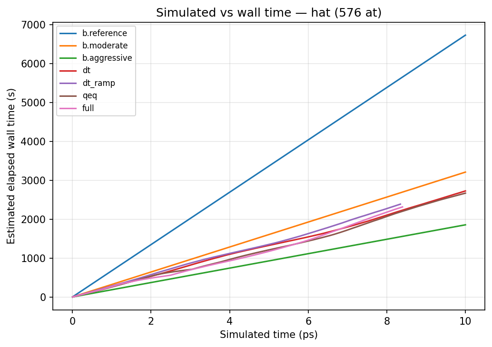

### Hat schedule, 1500 atoms

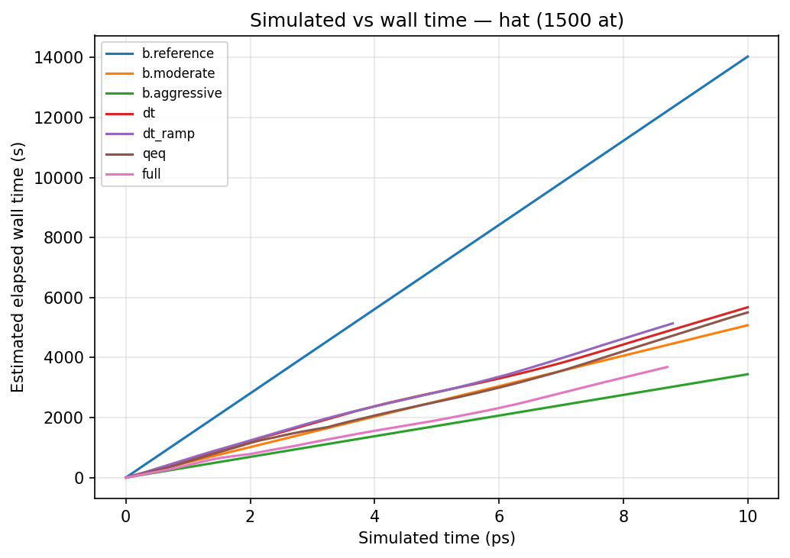

### Constant T schedule, 576 atoms

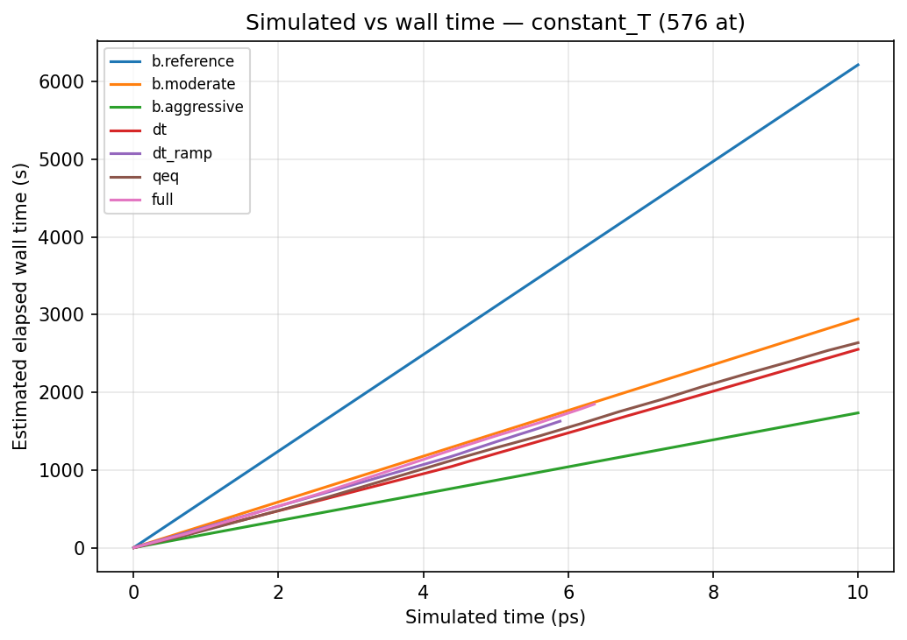

### Constant T schedule, 1500 atoms

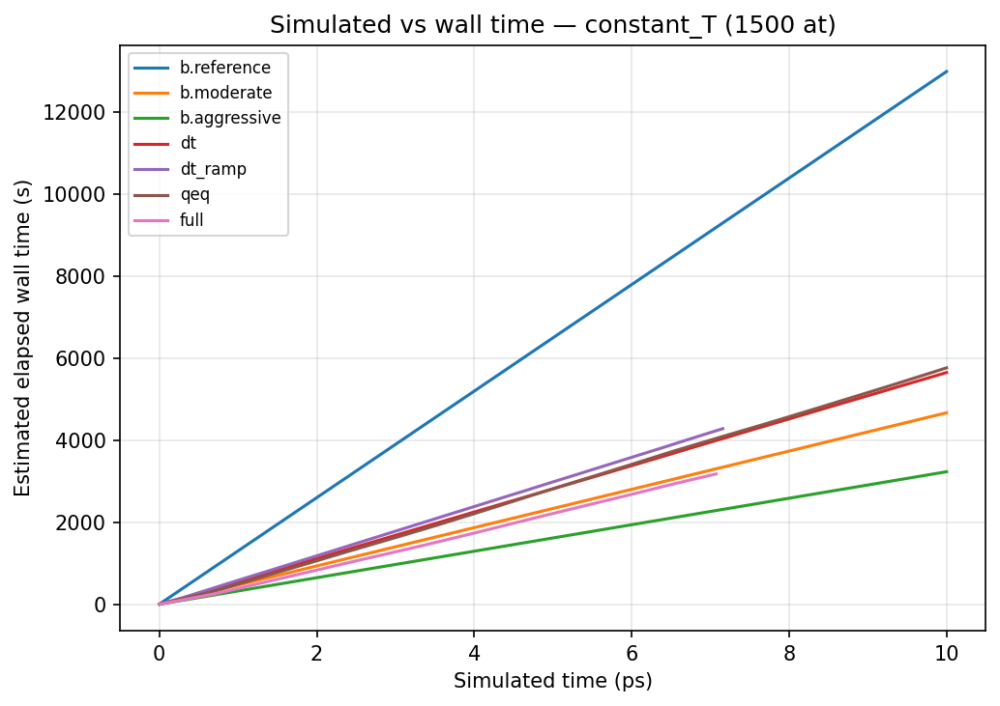

---

## Fig. S2 — Fidelity: etotal, pressure, charges

Etotal, pressure, q_t1_mean (Si), and q_std vs simulated time for reference, moderate, aggressive, and etl_full.

### Hat schedule, 576 atoms

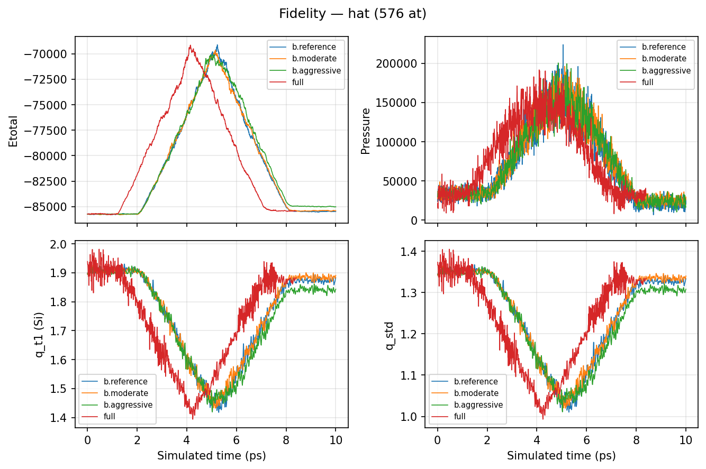

### Hat schedule, 1500 atoms

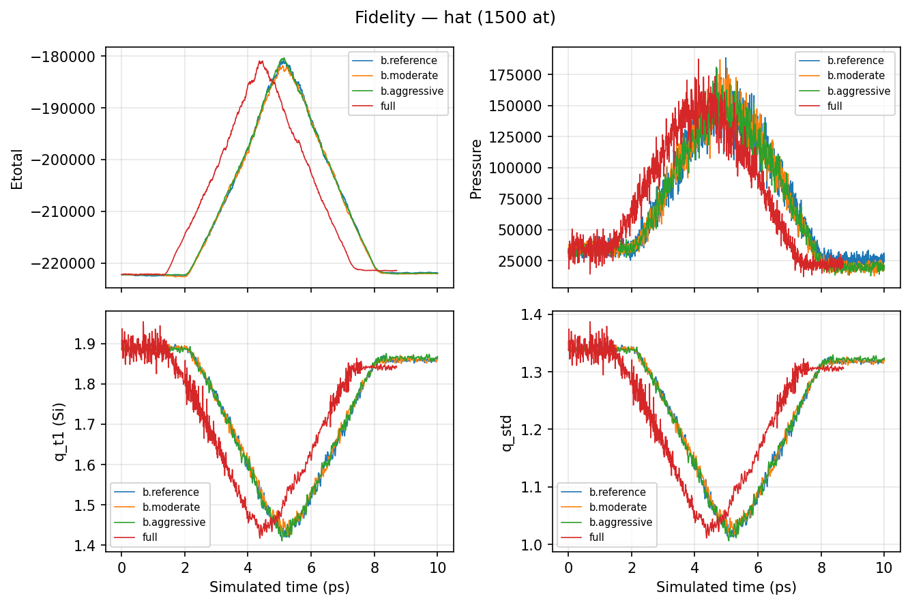

---

## Fig. S3 — Temperature schedule schematic

Hat (300→4500→300 K), milder (300→2000→300 K), and constant T = 300 K over 10 ps.

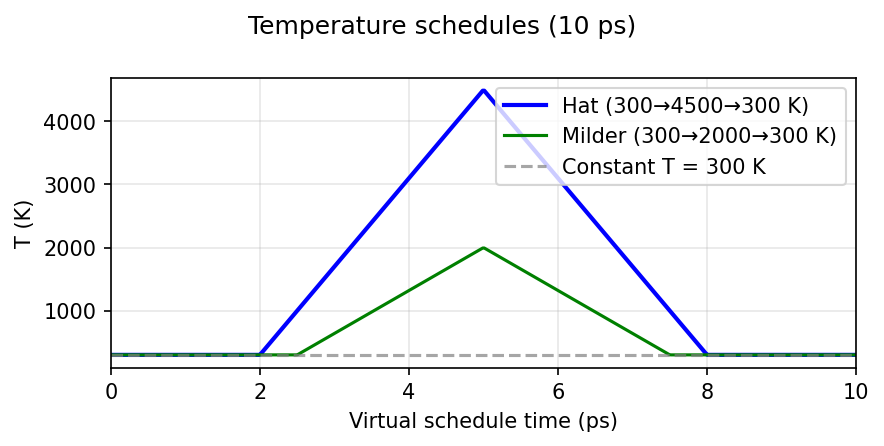

---

## Fig. S4 — Summary dashboards

Wall time bars, speedup vs moderate, etotal vs time, dt vs time for selected runs.

### Hat schedule, 576 atoms

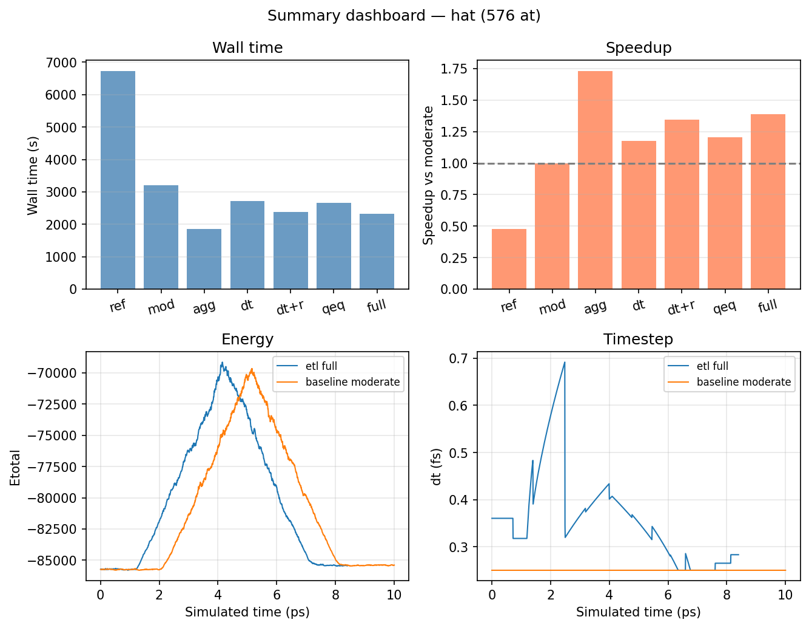

### Constant T schedule, 576 atoms

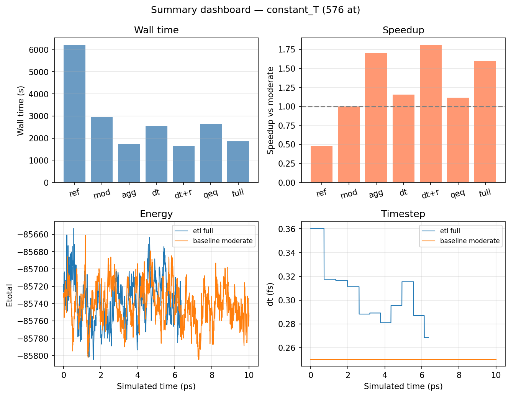

---

## Fig. S5 — Controller behavior (576-atom hat, etl_full)

dt, ramp_progress_ps, QEq tol (log), and S̄ vs simulated time.

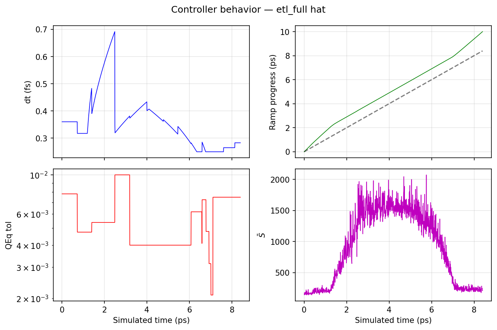

---

## Fig. S6 — Controller behavior (1500-atom constant T, etl_full)

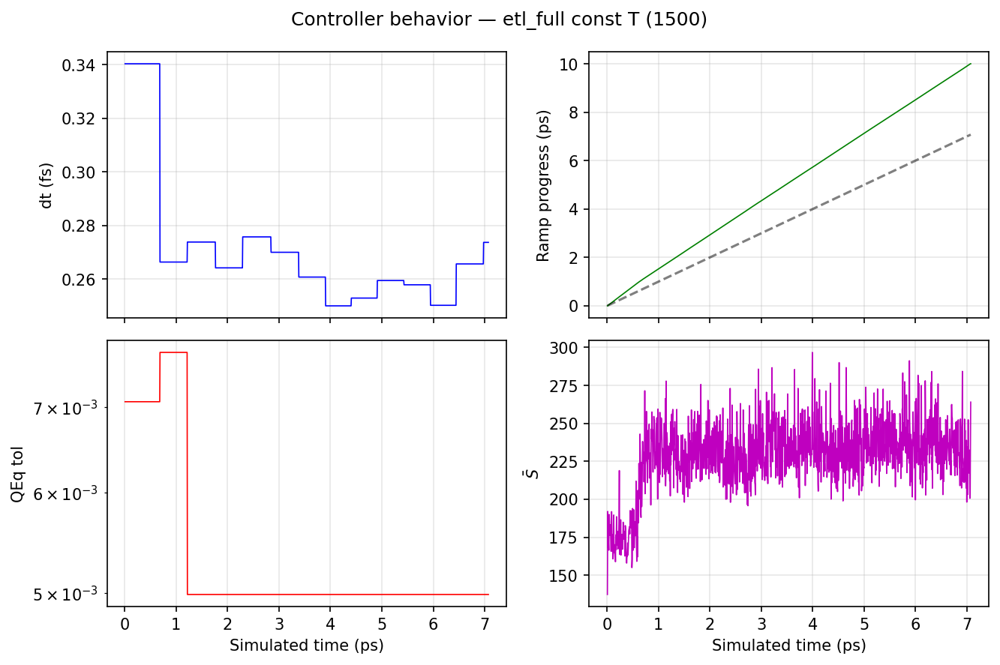

---

If output directories are missing, simulated-vs-wall and fidelity plots may be skipped by the script; wall-time and speedup bar charts use embedded report data and are always produced.
